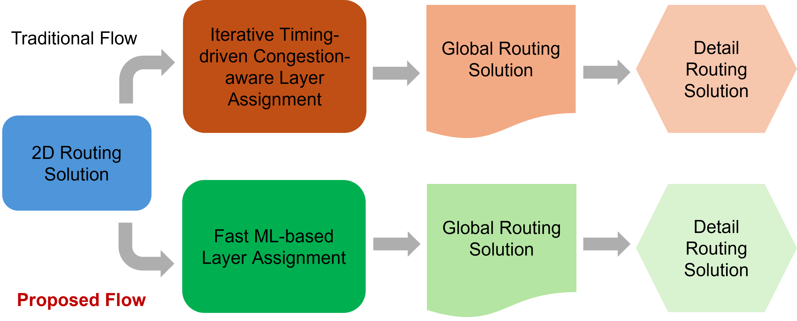

# ML for Layer Assignment using Hybrid GCN–CNN Model

This repository provides a framework for ML-based layer assignment in Global Routing. It includes code for generating data using traditional layer assignment algorithms, as well as scripts for training and evaluating a **Hybrid GCN–CNN architecture** designed specifically for layer assignment. Both traditional and ML-based layer assignment guides are evaluated to measure their impact on global routing and detailed routing metrics. 

---
## Abstract
Timing-driven layer assignment during global routing significantly impacts delay and congestion. Traditional methods rely on iterative heuristics with repeated timing and congestion analysis under the hood, leading to high runtime and limited scalability for modern designs. We present a hybrid machine learning (ML) framework that combines graph convolutional networks (GCNs) and convolutional neural networks (CNNs) for fast, timing- and congestion-driven layer assignment. GCNs model netlist connectivity and timing-critical paths, while CNNs extract spatial features such as capacity and utilization maps across the metal layer stack from a placed layout. Formulated as a multi-class classification problem, our model predicts the layer for every Steiner tree edge of a net. The ML model is trained on timing and congestion-driven global-routed layout data to predict optimized layer assignments rapidly in a single pass. Experiments on benchmark designs demonstrate that our approach improves worst-case and total negative slack post detailed route while achieving a speedup compared to traditional congestion and timing-driven methods.

## Table of Contents

-   [File structure](#file-structure)
-   [Benchmark data organization](#benchmark-data)
-   [How to run traditional models](#getting-started)
-   [How to run ML model](#running-gcn-cnn)
-   [Results](#results)

## File structure
- [README.md](./README.md)
- **src/**
  - **gcn_cnn/**
    - [data_struct_util.py](./src/gcn_cnn/data_struct_util.py)
    - [export_util.py](./src/gcn_cnn/export_util.py)
    - [gcn_cnn_util.py](./src/gcn_cnn/gcn_cnn_util.py)
    - [helpers.py](./src/gcn_cnn/helpers.py)
    - [parser_utils.py](./src/gcn_cnn/parser_utils.py)
    - [test_ml.py](./src/gcn_cnn/test_ml.py)
    - [train_ml.py](./src/gcn_cnn/train_ml.py)
  - **traditional_layer_assignment/**
    - [README.md](./src/traditional_layer_assignment/README.md)
    - [cdla.py](./src/traditional_layer_assignment/cdla.py)
    - [data_struct_util.py](./src/traditional_layer_assignment/data_struct_util.py)
    - [export_util.py](./src/traditional_layer_assignment/export_util.py)
    - [rc_tree_util.py](./src/traditional_layer_assignment/rc_tree_util.py)
    - [tdla.py](./src/traditional_layer_assignment/tdla.py)
- **results/**
  - **asap7/**
    - [data_point_details.xlsx](./results/asap7/data_point_details.xlsx)
    - [impact_on_detail_routing_metrics.xlsx](./results/asap7/impact_on_detail_routing_metrics.xlsx)
    - [impact_on_global_routing_metrics.xlsx](./results/asap7/impact_on_global_routing_metrics.xlsx)
  - **nangate45/**
    - [data_point_details.xlsx](./results/nangate45/data_point_details.xlsx)
    - [impact_on_detail_routing_metrics.xlsx](./results/nangate45/impact_on_detail_routing_metrics.xlsx)
    - [impact_on_global_routing_metrics.xlsx](./results/nangate45/impact_on_global_routing_metrics.xlsx)
- **scripts/**
  - [ord_query_cap_slacks.py](./scripts/ord_query_cap_slacks.py)

## Benchmark data organization

The `benchmarks/` directory contains the data used in this project. It includes data points generated for both **ASAP7** and **Nangate45** technology nodes using **[OpenROAD-Flow-Scripts](https://github.com/The-OpenROAD-Project/OpenROAD-flow-scripts)**.

### Directory Structure and Naming Convention

Each data point corresponds to a single ORFS run and is organized as: benchmarks/<tech>/<design>/<design>-<utilization>-<clock_period>/
Where:
- `design` – design name  
- `utilization` – target placement utilization (percentage)  
- `clock_period` – clock period (ps)

### Contents of a Data Point 
**Example:** - [jpg-37-680](./benchmarks/asap7/jpeg/jpg-37-680/)

Each data point directory contains the following files:

- `4_cts.def`, `5_1_grt.def`  
  DEF files dumped from **ORFS** by modifying `cts.tcl` and `global_route.tcl`.
  5_1_grt.def is used just to extract the GCELL sizes for grid initialization.

- `segment_route.guide`  
  Routing guide dumped after the global routing stage. The 3d segmnets are use dto extract 2d segmnets without any layer information which servers as the starting point for the code for generating timing and congestion guides

The following files are generated using the OpenROAD Python API:

- `pin_locations.txt`  
- `pin_cap_slacks.txt`

These files are produced by [ord_query_cap_slacks.py](./scripts/ord_query_cap_slacks.py) after CTS stage to get capacitances values at pins in a net and pin locations in a net.

## How to run traditional models

The traditional layer assignment algorithms generate timing-driven and congestion-driven routing guides.

From the `src/traditional_layer_assignment/` directory:

python3 cdla.py --folder_name ../benchmarks/asap7/jpeg/jpg-37-680/
python3 tdla.py --folder_name ../benchmarks/asap7/jpeg/jpg-37-680/

These commands generate congestion.guide and timing.guide files inside the specified benchmark data point directory.

## How to run ML model
The timing.guide files generated by the traditional timing-driven layer assignment are used as golden labels for training the ML model.

Training Example (JPEG Design)
For opt1 (Transferability across nets) - CUDA_VISIBLE_DEVICES=6 python3 train_ml.py --mode cross-design --cross-designs aes gcd ibex jpeg ethmac  --test-designs jpeg --test-dps 1 2 3 4 5 6 7 --test-dps-train-frac 0.2 --loss weighted_focal --gamma 1.5 --cb-beta 0.9999 --epochs 30
For opt2 ((Transferability across utilizations) - CUDA_VISIBLE_DEVICES=3 python3 train_ml.py --mode cross-design --cross-designs aes gcd ibex jpeg ethmac --test-designs jpeg --test-dps 1 2 3 5 7 --loss weighted_focal --gamma 1.5 --cb-beta 0.9999 --epochs 30
For opt3 (Transferability across designs) - CUDA_VISIBLE_DEVICES=3 python3 train_ml.py   --mode explicit   --train-designs ibex aes gcd ethmac   --test-designs-explicit jpeg   --epochs 30   --loss weighted_focal --gamma 1.5 --cb-beta 0.9999  --test-size 1.0

Each trained model produces:

A checkpoint file (.ckpt)

A normalization file

These files are used during inference to generate ML-based routing guides.

For example opt1: 

CUDA_VISIBLE_DEVICES=2 python3 test_ml.py \
  --folders /data/sjulaka6/data/asap7/jpeg/data_point_1 \
	/data/sjulaka6/data/asap7/jpeg/data_point_2 \
	/data/sjulaka6/data/asap7/jpeg/data_point_3 \
	/data/sjulaka6/data/asap7/jpeg/data_point_4 \
	/data/sjulaka6/data/asap7/jpeg/data_point_5 \
	/data/sjulaka6/data/asap7/jpeg/data_point_6 \
  /data/sjulaka6/data/asap7/jpeg/data_point_7 \
  --ckpt outputs/best_model_opt1_test-jpeg_e30_wfl.pt \
  --norm-path outputs/norm_opt1_test-jpeg_e30_wfl.pt \
  --guide-name ml_pred_opt1.guide

## Results

The `results/` directory contains `.xlsx` files that report routing performance after running the layer assignment guides through global and detailed routing using **[OpenROAD](https://theopenroadproject.org/)**.  
Results are provided for both ML-based and traditional timing-driven and congestion-driven layer assignment algorithms across all datapoints in the **ASAP7** and **Nangate45** technology nodes.

The file **`datapoints_details.xlsx`** summarizes the attributes of each datapoint and documents how these values were generated.

---

